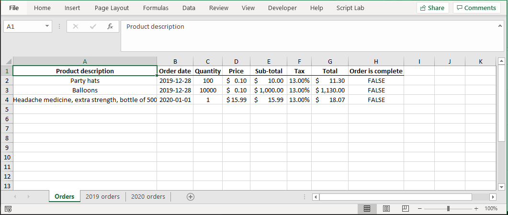

# DataExport.Excel

DataExport is a utility for serializing POCO collections to Excel, motivated by a need to create simple Excel spreadsheets from .NET objects. Using [NPOI](https://github.com/tonyqus/npoi) as the underlying Excel engine, it uses property attributes to specify the serializtion behaviour.

## Example

Use the `ExcelSpreadsheet*` attributes to describe how the object is to be serialized.

```csharp
[ExcelSpreadsheet("Orders")]
public class Order
{
  [ExcelSpreadsheetIgnoreColumn()]
  public Guid OrderId { get; set; } = new Guid();

  [ExcelSpreadsheetColumn("Product description", Order = 0)]
  public string Description { get; set; }

  [ExcelSpreadsheetColumn("Order date", Order = 1, CellFormat = CellFormats.SHORT_DATE)]
  public DateTime OrderDate { get; set; }

  [ExcelSpreadsheetColumn(Order = 2)]
  public int Quantity { get; set; }

  [ExcelSpreadsheetColumn("Order is complete")]
  public bool OrderIsComplete { get; set; }

  [ExcelSpreadsheetColumn("Price", Order = 3, CellFormat = CellFormats.ACCOUNTING)]
  public decimal UnitPrice { get; set; }

  [ExcelSpreadsheetColumn("Sub-total", Order = 4, CellFormat = CellFormats.ACCOUNTING)]
  public double SubTotal { get; set; }

  [ExcelSpreadsheetColumn(Order = 6, CellFormat = CellFormats.ACCOUNTING)]
  public double Total { get; set; }

  [ExcelSpreadsheetColumn(Order = 5, CellFormat = CellFormats.PERCENTAGE)]
  public double Tax { get; set; }
}
```

Create the spreadsheet by simply populating the POCO collection (`IEnumerable<T>`) and adding it to the workbook.

```csharp
List<Order> orders = new List<Order>()
{
  new Order()
  {
    Description ="Party hats",
    OrderDate = new DateTime(2019, 12, 28),
    OrderIsComplete = false,
    Quantity = 100,
    UnitPrice = 0.1m,
    SubTotal = 100 * 0.1,
    Tax = 0.13,
    Total = 100 * 0.1* (1 + 0.13)
  },
  new Order()
  {
    Description ="Balloons",
    OrderDate = new DateTime(2019, 12, 28),
    OrderIsComplete = false,
    Quantity = 10000,
    UnitPrice = 0.1m,
    SubTotal = 10000 * 0.1,
    Tax = 0.13,
    Total = 10000 * 0.1 * (1 + 0.13)
  },
  new Order()
  {
    Description ="Headache medicine, extra strength, bottle of 500",
    OrderDate = new DateTime(2020, 1, 1),
    OrderIsComplete = false,
    Quantity = 1,
    UnitPrice = 15.99m,
    SubTotal = 1 * 15.99,
    Tax = 0.13,
    Total = 1 * 15.99 * (1 + 0.13)
  },
};

ExcelWorkbook workbook = new ExcelWorkbook();

workbook.AddSpreadheet(orders);
workbook.AddSpreadheet(orders.Where(x => x.OrderDate.Year == 2019), "2019 orders"); // Overwrite the spreadsheet name.
workbook.AddSpreadheet(orders.Where(x => x.OrderDate.Year == 2020), "2020 orders");
workbook.Save(new FileInfo(...));
```

The resulting Excel spreadsheet looks like this...


